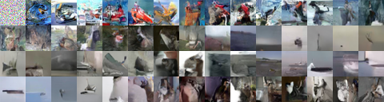

# Generalized VAE with PixelCNN Decoder


This repo implements the methods described in [Towards a Deeper Understanding of Variational Autoencoding Models](https://arxiv.org/abs/1702.08658). A VAE with powerful decoding family such as PixelCNN tend to ignore latent code, and use only the decoding distribution to represent the entire dataset. This paper showed that this phenomenon is not general. For a more general family of VAE models, there are members that prefer to use the latent code. In particular, without any regularization on the posterior the model will prefer to use latent code. Furthermore we can still obtain correct samples, albeit only through a Markov chain.

- Samples generated by model without regularization


- Samples generated by model with ELBO regularization



# Training with Default Options

## Setup

Make sure you have the following installed

- python 2 or 3 with numpy and scipy
- tensorflow (Tested on tensorflow 0.12)

## Train on CIFAR

To train on CIFAR with ELBO regularization

```python train.py --use_autoencoder --save_dir=elbo --reg_type=elbo --gpus=0,1,2,3``` 

To train on CIFAR without regularization

```python train.py --use_autoencoder --save_dir=no_reg --reg_type=no_reg --gpus=0,1,2,3```

You must replace the ```--gpus=[ids]``` to id of GPUs that are present in your system. 

# Additional Options

- To use a particular GPU/GPUs add option ```--gpus=[ids]``` such as ```--gpus=0,1``` to use GPU 0 and 1. Using Multi-GPUs is recommended
- To specify batch size use ```--batch_size=[size]```
- To specify dimension of latent code use ```--latent_dim=[dim]```
- To specify the directory to place all checkpoint, logs and visualizations use ```--save_dir=/path/to/folder```. To visualize with tensorboard set this directory as the logdir.
- To use checkpoint file if one exists in model directory, use ```--load_params```
- For more options and their meaning please refer to the original [PixelCNN++](https://github.com/openai/pixel-cnn)

